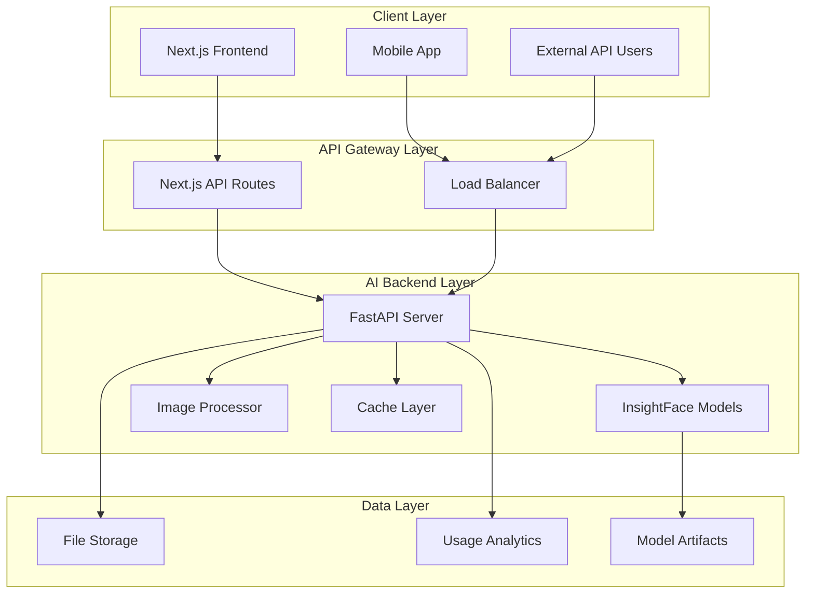

# 🏗️ 아키텍처 설계 문서 (Architecture Design)

## 📌 개요

InsightFace 기반 얼굴 분석 백엔드의 전체 아키텍처 설계 문서입니다. 고성능, 확장성, 유지보수성을 고려한 설계를 제시합니다.

## 🎯 아키텍처 목표

1. **고성능**: 실시간 얼굴 분석 처리
2. **확장성**: 트래픽 증가에 따른 수평 확장
3. **안정성**: 장애 복구 및 에러 처리
4. **유지보수성**: 모듈화된 구조
5. **호환성**: 기존 Next.js 시스템과 seamless 연동

## 🏛️ 전체 시스템 아키텍처



## 🔧 백엔드 내부 아키텍처

### 1. 계층별 구조 (Layered Architecture)

```
┌─────────────────────────────────────┐
│         API Layer (FastAPI)         │
├─────────────────────────────────────┤
│       Business Logic Layer          │
├─────────────────────────────────────┤
│       AI Model Layer               │
├─────────────────────────────────────┤
│       Data Access Layer            │
└─────────────────────────────────────┘
```

### 2. 모듈 구조

```
app/
├── api/                    # API 엔드포인트
│   ├── __init__.py
│   ├── routes/
│   │   ├── __init__.py
│   │   ├── faces.py        # 얼굴 관련 API
│   │   ├── health.py       # 헬스체크
│   │   └── batch.py        # 배치 처리
│   └── dependencies.py     # 의존성 주입
├── core/                   # 핵심 설정
│   ├── __init__.py
│   ├── config.py          # 환경 설정
│   ├── security.py        # 보안 관련
│   └── logging.py         # 로깅 설정
├── models/                 # AI 모델 관련
│   ├── __init__.py
│   ├── face_analyzer.py   # InsightFace 래퍼
│   ├── model_manager.py   # 모델 로딩/관리
│   └── cache_manager.py   # 결과 캐싱
├── services/              # 비즈니스 로직
│   ├── __init__.py
│   ├── face_service.py    # 얼굴 분석 서비스
│   ├── comparison_service.py  # 비교 로직
│   └── batch_service.py   # 배치 처리
├── utils/                 # 유틸리티
│   ├── __init__.py
│   ├── image_utils.py     # 이미지 처리
│   ├── validation.py      # 입력 검증
│   └── metrics.py         # 성능 메트릭
├── schemas/               # Pydantic 스키마
│   ├── __init__.py
│   ├── requests.py        # 요청 스키마
│   └── responses.py       # 응답 스키마
└── main.py               # FastAPI 앱 엔트리포인트
```

## 🧠 AI 모델 아키텍처

### 1. InsightFace 모델 구성

```python
# 모델 스택
┌─────────────────────────────────────┐
│        Face Detection               │
│      (SCRFD/RetinaFace)            │
├─────────────────────────────────────┤
│       Face Alignment                │
│    (Landmark Detection)             │
├─────────────────────────────────────┤
│     Face Recognition                │
│      (ArcFace/CosFace)             │
├─────────────────────────────────────┤
│    Attribute Analysis               │
│   (Age/Gender/Emotion)              │
└─────────────────────────────────────┘
```

### 2. 모델 로딩 전략

```python
class ModelManager:
    """모델 로딩 및 관리"""
    
    def __init__(self):
        self.models = {}
        self.model_locks = {}
    
    async def load_model(self, model_name: str):
        """지연 로딩 (Lazy Loading)"""
        if model_name not in self.models:
            # 첫 요청 시에만 로딩
            self.models[model_name] = await self._load_model_async(model_name)
        return self.models[model_name]
    
    def get_model_memory_usage(self):
        """메모리 사용량 모니터링"""
        pass
```

### 3. 처리 파이프라인

```python
# 단일 얼굴 분석 파이프라인
def analyze_face(image: np.ndarray) -> FaceAnalysisResult:
    """
    1. 이미지 전처리
    2. 얼굴 감지
    3. 랜드마크 추출
    4. 얼굴 정렬
    5. 특징 추출 (임베딩)
    6. 속성 분석
    7. 결과 후처리
    """
    pass

# 배치 처리 파이프라인  
def analyze_faces_batch(images: List[np.ndarray]) -> List[FaceAnalysisResult]:
    """
    1. 배치 전처리
    2. 병렬 얼굴 감지
    3. 배치 특징 추출
    4. 유사도 매트릭스 계산
    5. 결과 집계
    """
    pass
```

## 🚀 성능 최적화 전략

### 1. 모델 최적화

```python
# ONNX 런타임 최적화
import onnxruntime as ort

class OptimizedModel:
    def __init__(self, model_path: str):
        # CPU 최적화 설정
        sess_options = ort.SessionOptions()
        sess_options.graph_optimization_level = ort.GraphOptimizationLevel.ORT_ENABLE_ALL
        sess_options.intra_op_num_threads = 4
        
        # GPU 사용 시
        providers = ['CUDAExecutionProvider', 'CPUExecutionProvider']
        
        self.session = ort.InferenceSession(
            model_path, 
            sess_options, 
            providers=providers
        )
```

### 2. 캐싱 전략

```python
# 3단계 캐싱
┌─────────────────────────────────────┐
│        Memory Cache                 │
│     (Recently Used Results)         │
├─────────────────────────────────────┤
│         Redis Cache                 │
│    (Distributed Results)            │
├─────────────────────────────────────┤
│       File System Cache             │
│    (Long-term Embeddings)           │
└─────────────────────────────────────┘

# 구현 예시
class CacheManager:
    def __init__(self):
        self.memory_cache = LRUCache(maxsize=1000)
        self.redis_client = redis.Redis()
        self.file_cache_dir = "/tmp/face_cache"
    
    async def get_embedding(self, image_hash: str):
        # 1. 메모리 캐시 확인
        if embedding := self.memory_cache.get(image_hash):
            return embedding
            
        # 2. Redis 캐시 확인
        if embedding := await self.redis_client.get(f"emb:{image_hash}"):
            self.memory_cache[image_hash] = embedding
            return embedding
            
        # 3. 파일 캐시 확인
        cache_file = f"{self.file_cache_dir}/{image_hash}.npy"
        if os.path.exists(cache_file):
            embedding = np.load(cache_file)
            await self.redis_client.setex(f"emb:{image_hash}", 3600, embedding)
            self.memory_cache[image_hash] = embedding
            return embedding
            
        return None
```

### 3. 이미지 처리 최적화

```python
class ImageProcessor:
    """고성능 이미지 처리"""
    
    @staticmethod
    async def preprocess_image(image_data: str) -> np.ndarray:
        """비동기 이미지 전처리"""
        # Base64 디코딩
        image_bytes = base64.b64decode(image_data.split(',')[1])
        
        # PIL을 통한 빠른 로딩
        image = Image.open(io.BytesIO(image_bytes))
        
        # OpenCV로 변환 (더 빠른 처리)
        image_array = cv2.cvtColor(np.array(image), cv2.COLOR_RGB2BGR)
        
        # 리사이징 최적화
        if image_array.shape[0] > 1024 or image_array.shape[1] > 1024:
            image_array = cv2.resize(image_array, (1024, 1024))
            
        return image_array
    
    @staticmethod
    def normalize_face(face_img: np.ndarray) -> np.ndarray:
        """얼굴 이미지 정규화"""
        # 히스토그램 평활화
        face_img = cv2.equalizeHist(face_img)
        
        # 정규화
        face_img = face_img.astype(np.float32) / 255.0
        
        return face_img
```

## 💾 데이터 처리 아키텍처

### 1. 이미지 저장 전략

```python
# 임시 저장 (보안)
┌─────────────────────────────────────┐
│     Memory Buffer (< 1 sec)         │
├─────────────────────────────────────┤
│    Temp File System (< 1 min)       │
├─────────────────────────────────────┤
│     Processed Results Only           │
│    (Embeddings, Metadata)            │
└─────────────────────────────────────┘

class SecureImageHandler:
    """보안을 고려한 이미지 처리"""
    
    def __init__(self):
        self.temp_dir = tempfile.mkdtemp()
        
    async def process_image_secure(self, image_data: str) -> dict:
        """이미지 처리 후 즉시 삭제"""
        temp_file = None
        try:
            # 임시 파일 생성
            temp_file = tempfile.NamedTemporaryFile(
                dir=self.temp_dir, 
                delete=False,
                suffix='.jpg'
            )
            
            # 이미지 처리
            result = await self.analyze_image(temp_file.name)
            
            return result
            
        finally:
            # 임시 파일 즉시 삭제
            if temp_file and os.path.exists(temp_file.name):
                os.unlink(temp_file.name)
```

### 2. 사용량 추적 아키텍처

```python
class UsageTracker:
    """사용량 추적 및 분석"""
    
    def __init__(self):
        self.influxdb_client = InfluxDBClient()
        
    async def track_request(self, request_data: dict):
        """요청 메트릭 기록"""
        metrics = {
            "measurement": "api_requests",
            "tags": {
                "endpoint": request_data["endpoint"],
                "status": request_data["status"],
                "model": request_data["model"]
            },
            "fields": {
                "response_time_ms": request_data["response_time"],
                "image_size_kb": request_data["image_size"],
                "face_count": request_data["face_count"]
            },
            "time": datetime.utcnow()
        }
        
        await self.influxdb_client.write(metrics)
```

## 🔒 보안 아키텍처

### 1. 다층 보안 모델

```
┌─────────────────────────────────────┐
│        Rate Limiting                │
├─────────────────────────────────────┤
│       Input Validation              │
├─────────────────────────────────────┤
│      API Authentication             │
├─────────────────────────────────────┤
│     Data Encryption                 │
├─────────────────────────────────────┤
│    Secure Image Handling            │
└─────────────────────────────────────┘
```

### 2. 구현 세부사항

```python
class SecurityMiddleware:
    """보안 미들웨어"""
    
    async def __call__(self, request: Request, call_next):
        # Rate limiting 체크
        if not await self.check_rate_limit(request):
            raise HTTPException(429, "Too Many Requests")
            
        # API 키 검증
        if not await self.validate_api_key(request):
            raise HTTPException(401, "Unauthorized")
            
        # 입력 검증
        if not await self.validate_input(request):
            raise HTTPException(400, "Invalid Input")
            
        response = await call_next(request)
        
        # 응답 후처리 (로깅, 메트릭)
        await self.log_request(request, response)
        
        return response
```

## 📊 모니터링 아키텍처

### 1. 메트릭 수집

```python
# 성능 메트릭
- Request latency (p50, p95, p99)
- Throughput (requests/second)
- Error rate (% of failed requests)
- Model inference time
- Memory usage
- GPU utilization

# 비즈니스 메트릭  
- API usage by endpoint
- Face detection success rate
- Similarity score distribution
- User activity patterns
```

### 2. 알림 시스템

```python
class AlertManager:
    """알림 관리 시스템"""
    
    def __init__(self):
        self.thresholds = {
            "response_time": 1000,  # ms
            "error_rate": 0.05,     # 5%
            "memory_usage": 0.85,   # 85%
        }
    
    async def check_metrics(self):
        """메트릭 체크 및 알림"""
        current_metrics = await self.get_current_metrics()
        
        for metric, threshold in self.thresholds.items():
            if current_metrics[metric] > threshold:
                await self.send_alert(metric, current_metrics[metric])
```

## 🔧 배포 아키텍처

### 1. 컨테이너화

```dockerfile
# Multi-stage build
FROM python:3.9-slim as builder
WORKDIR /app
COPY requirements.txt .
RUN pip install --no-cache-dir -r requirements.txt

FROM python:3.9-slim as runtime
WORKDIR /app
COPY --from=builder /usr/local/lib/python3.9/site-packages /usr/local/lib/python3.9/site-packages
COPY . .

# 헬스체크
HEALTHCHECK --interval=30s --timeout=10s --start-period=60s \
  CMD curl -f http://localhost:8000/health || exit 1

CMD ["uvicorn", "app.main:app", "--host", "0.0.0.0", "--port", "8000"]
```

### 2. 오케스트레이션 (Kubernetes)

```yaml
# deployment.yaml
apiVersion: apps/v1
kind: Deployment
metadata:
  name: face-api
spec:
  replicas: 3
  selector:
    matchLabels:
      app: face-api
  template:
    metadata:
      labels:
        app: face-api
    spec:
      containers:
      - name: face-api
        image: face-api:latest
        ports:
        - containerPort: 8000
        resources:
          requests:
            memory: "2Gi"
            cpu: "1000m"
          limits:
            memory: "4Gi" 
            cpu: "2000m"
        livenessProbe:
          httpGet:
            path: /health
            port: 8000
          initialDelaySeconds: 30
          periodSeconds: 10
```

## 📈 확장성 고려사항

### 1. 수평 확장 (Horizontal Scaling)

```python
# 무상태 설계 (Stateless)
- 모든 상태는 외부 저장소(Redis, DB)에 저장
- 인스턴스 간 세션 공유 없음
- 로드밸런서를 통한 요청 분산

# 오토스케일링
- CPU/메모리 사용률 기반
- Queue 길이 기반  
- 요청 지연시간 기반
```

### 2. 수직 확장 (Vertical Scaling)

```python
# GPU 활용
- CUDA 기반 모델 추론 가속
- 배치 처리를 통한 GPU 효율성 극대화
- 모델 병렬 처리

# 메모리 최적화
- 모델 양자화 (FP16, INT8)
- 동적 배치 크기 조정
- 메모리 풀링
```

## 🔄 장애 복구 전략

### 1. Circuit Breaker Pattern

```python
class CircuitBreaker:
    """회로 차단기 패턴"""
    
    def __init__(self, failure_threshold=5, recovery_timeout=60):
        self.failure_threshold = failure_threshold
        self.recovery_timeout = recovery_timeout
        self.failure_count = 0
        self.last_failure_time = None
        self.state = "CLOSED"  # CLOSED, OPEN, HALF_OPEN
    
    async def call(self, func, *args, **kwargs):
        if self.state == "OPEN":
            if time.time() - self.last_failure_time > self.recovery_timeout:
                self.state = "HALF_OPEN"
            else:
                raise Exception("Circuit breaker is OPEN")
        
        try:
            result = await func(*args, **kwargs)
            self.on_success()
            return result
        except Exception as e:
            self.on_failure()
            raise e
```

### 2. Graceful Degradation

```python
# 단계적 성능 저하
1. 고성능 모드 (GPU + 전체 모델)
2. 표준 모드 (CPU + 경량 모델)  
3. 기본 모드 (Simple feature matching)
4. 캐시 모드 (Pre-computed results only)
```

---

**작성일**: 2025-09-19  
**버전**: 1.0.0  
**작성자**: AI Backend Team