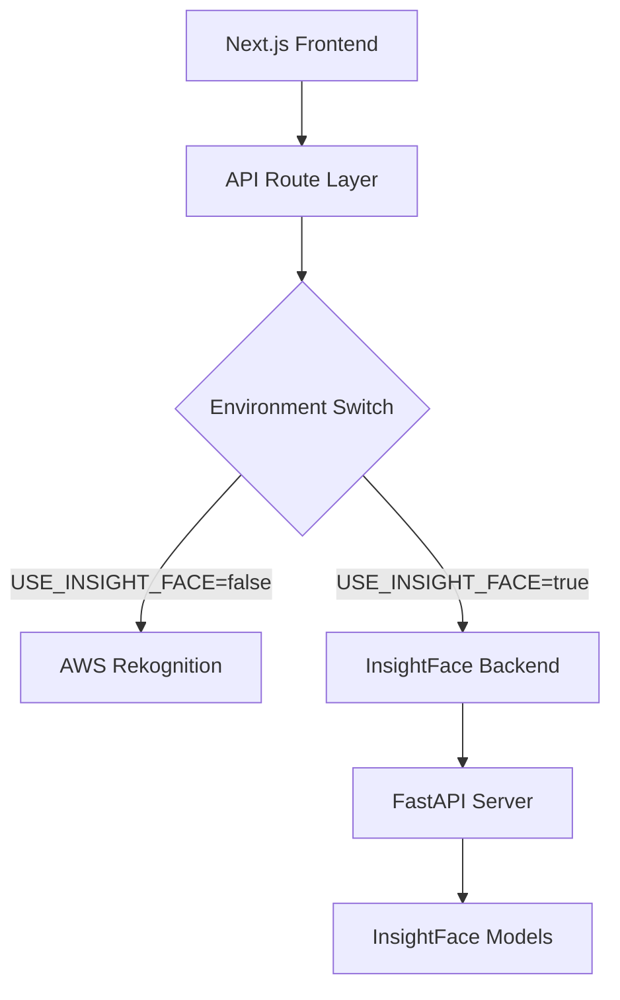

# 🔗 Next.js 연동 계획 (Integration Plan)

## 📌 개요

기존 Next.js 프로젝트와 새로운 InsightFace 백엔드를 하이브리드로 연동하기 위한 상세 계획입니다. 무중단 서비스와 점진적 전환을 목표로 합니다.

## 🎯 연동 전략

### 1. 하이브리드 아키텍처



### 2. 전환 단계

```
Phase 1: 개발환경 구축 (1주)
├── Python 백엔드 로컬 개발
├── 기본 API 구현
└── 단위 테스트

Phase 2: 연동 구현 (3일)
├── Next.js API Routes 수정
├── 환경변수 기반 라우팅
└── 응답 포맷 표준화

Phase 3: 테스트 및 검증 (2일)
├── 기능 동등성 검증
├── 성능 비교 테스트
└── 에러 처리 검증

Phase 4: 점진적 배포 (1주)
├── 개발자 테스트 (100% InsightFace)
├── A/B 테스트 (50/50)
├── 단계적 전환 (80/20, 90/10, 100/0)
└── AWS 완전 대체
```

## 🔧 구현 세부사항

### 1. 환경변수 설정

#### `.env.local` 업데이트
```env
# 기존 AWS 설정
AWS_ACCESS_KEY_ID=your-aws-key
AWS_SECRET_ACCESS_KEY=your-aws-secret
AWS_REGION=ap-northeast-2

# 새로운 InsightFace 설정
USE_INSIGHT_FACE=false                    # true로 변경시 InsightFace 사용
INSIGHT_FACE_API_URL=http://localhost:8000
INSIGHT_FACE_API_KEY=your-api-key         # 선택사항
INSIGHT_FACE_TIMEOUT=30000                # 30초 타임아웃

# 하이브리드 설정
FALLBACK_TO_AWS=true                      # InsightFace 실패시 AWS 사용
A_B_TEST_RATIO=0.0                        # 0.0=AWS만, 1.0=InsightFace만
LOG_COMPARISON=true                       # 결과 비교 로깅
```

### 2. Next.js API Routes 수정

#### 공통 유틸리티 생성
```typescript
// src/lib/ai-service-router.ts
export interface FaceComparisonRequest {
  sourceImage: string;
  targetImage: string;
  similarityThreshold?: number;
}

export interface FaceComparisonResponse {
  success: boolean;
  data?: {
    similarity: number;
    faceMatches: any[];
    sourceImageFace?: any;
    unmatchedFaces: any[];
  };
  error?: string;
  metadata?: {
    provider: 'aws' | 'insightface';
    processingTimeMs: number;
  };
}

class AIServiceRouter {
  private useInsightFace: boolean;
  private fallbackToAWS: boolean;
  private abTestRatio: number;

  constructor() {
    this.useInsightFace = process.env.USE_INSIGHT_FACE === 'true';
    this.fallbackToAWS = process.env.FALLBACK_TO_AWS === 'true';
    this.abTestRatio = parseFloat(process.env.A_B_TEST_RATIO || '0');
  }

  private shouldUseInsightFace(userId?: string): boolean {
    // A/B 테스트 로직
    if (this.abTestRatio > 0) {
      const userHash = userId ? this.hashUserId(userId) : Math.random();
      return userHash < this.abTestRatio;
    }
    
    return this.useInsightFace;
  }

  private hashUserId(userId: string): number {
    // 일관된 해시 함수 (같은 사용자는 항상 같은 결과)
    let hash = 0;
    for (let i = 0; i < userId.length; i++) {
      const char = userId.charCodeAt(i);
      hash = ((hash << 5) - hash) + char;
      hash = hash & hash;
    }
    return Math.abs(hash) / 2147483647;
  }

  async compareFaces(
    request: FaceComparisonRequest,
    userId?: string
  ): Promise<FaceComparisonResponse> {
    const startTime = Date.now();
    const useInsightFace = this.shouldUseInsightFace(userId);

    try {
      if (useInsightFace) {
        const result = await this.callInsightFace(request);
        result.metadata = {
          provider: 'insightface',
          processingTimeMs: Date.now() - startTime
        };
        return result;
      } else {
        const result = await this.callAWS(request);
        result.metadata = {
          provider: 'aws',
          processingTimeMs: Date.now() - startTime
        };
        return result;
      }
    } catch (error) {
      console.error(`Error with ${useInsightFace ? 'InsightFace' : 'AWS'}:`, error);
      
      // Fallback 로직
      if (useInsightFace && this.fallbackToAWS) {
        console.log('Falling back to AWS Rekognition');
        try {
          const result = await this.callAWS(request);
          result.metadata = {
            provider: 'aws',
            processingTimeMs: Date.now() - startTime
          };
          return result;
        } catch (fallbackError) {
          console.error('Fallback to AWS also failed:', fallbackError);
        }
      }

      return {
        success: false,
        error: error instanceof Error ? error.message : 'Unknown error',
        metadata: {
          provider: useInsightFace ? 'insightface' : 'aws',
          processingTimeMs: Date.now() - startTime
        }
      };
    }
  }

  private async callInsightFace(request: FaceComparisonRequest): Promise<FaceComparisonResponse> {
    const apiUrl = process.env.INSIGHT_FACE_API_URL;
    const apiKey = process.env.INSIGHT_FACE_API_KEY;
    const timeout = parseInt(process.env.INSIGHT_FACE_TIMEOUT || '30000');

    const headers: Record<string, string> = {
      'Content-Type': 'application/json',
    };

    if (apiKey) {
      headers['X-API-Key'] = apiKey;
    }

    const response = await fetch(`${apiUrl}/compare-faces`, {
      method: 'POST',
      headers,
      body: JSON.stringify({
        source_image: request.sourceImage,
        target_image: request.targetImage,
        similarity_threshold: request.similarityThreshold || 0.01
      }),
      signal: AbortSignal.timeout(timeout)
    });

    if (!response.ok) {
      throw new Error(`InsightFace API error: ${response.status} ${response.statusText}`);
    }

    const result = await response.json();
    
    // InsightFace 응답을 AWS 포맷으로 변환
    return this.convertInsightFaceToAWS(result);
  }

  private async callAWS(request: FaceComparisonRequest): Promise<FaceComparisonResponse> {
    // 기존 AWS Rekognition 호출 로직
    const { compareFaces } = await import('@/lib/aws/rekognition');
    return await compareFaces(
      request.sourceImage,
      request.targetImage,
      request.similarityThreshold
    );
  }

  private convertInsightFaceToAWS(insightFaceResult: any): FaceComparisonResponse {
    if (!insightFaceResult.success) {
      return {
        success: false,
        error: insightFaceResult.error?.message || 'InsightFace processing failed'
      };
    }

    const data = insightFaceResult.data;
    
    return {
      success: true,
      data: {
        similarity: data.similarity * 100, // 0-1 → 0-100 변환
        faceMatches: data.face_matches?.map((match: any) => ({
          similarity: match.similarity * 100,
          face: {
            boundingBox: {
              width: match.bounding_box.width,
              height: match.bounding_box.height,
              left: match.bounding_box.x,
              top: match.bounding_box.y
            },
            confidence: match.confidence * 100
          }
        })) || [],
        sourceImageFace: data.source_face ? {
          boundingBox: {
            width: data.source_face.bounding_box.width,
            height: data.source_face.bounding_box.height,
            left: data.source_face.bounding_box.x,
            top: data.source_face.bounding_box.y
          },
          confidence: data.source_face.confidence * 100
        } : undefined,
        unmatchedFaces: data.target_faces?.filter((face: any) => 
          !data.face_matches?.some((match: any) => 
            Math.abs(match.bounding_box.x - face.bounding_box.x) < 10
          )
        ).map((face: any) => ({
          boundingBox: {
            width: face.bounding_box.width,
            height: face.bounding_box.height,
            left: face.bounding_box.x,
            top: face.bounding_box.y
          },
          confidence: face.confidence * 100
        })) || []
      }
    };
  }
}

export const aiServiceRouter = new AIServiceRouter();
```

#### API Routes 업데이트

```typescript
// src/app/api/rekognition/compare-faces/route.ts
import { NextRequest, NextResponse } from 'next/server';
import { aiServiceRouter } from '@/lib/ai-service-router';

export async function POST(request: NextRequest) {
  try {
    const { sourceImage, targetImage, similarityThreshold } = await request.json();
    const userId = request.headers.get('x-user-id'); // 선택사항

    console.log('=== Compare Faces API Called ===');
    console.log('Source image length:', sourceImage?.length);
    console.log('Target image length:', targetImage?.length);
    console.log('Similarity threshold:', similarityThreshold);

    if (!sourceImage || !targetImage) {
      return NextResponse.json(
        { success: false, error: 'Both source and target images are required' },
        { status: 400 }
      );
    }

    // AI 서비스 라우터를 통해 처리
    const result = await aiServiceRouter.compareFaces({
      sourceImage,
      targetImage,
      similarityThreshold
    }, userId || undefined);

    console.log('AI Service result:', JSON.stringify(result, null, 2));

    // 사용량 추적 (기존 로직 유지)
    if (result.success) {
      try {
        await fetch(`${process.env.NEXT_PUBLIC_BASE_URL || 'http://localhost:3000'}/api/monitoring/usage`, {
          method: 'POST',
          headers: { 'Content-Type': 'application/json' },
          body: JSON.stringify({ 
            operation: 'compareFaces',
            provider: result.metadata?.provider 
          }),
        });
      } catch (trackingError) {
        console.warn('Failed to track usage:', trackingError);
      }
    }

    if (!result.success) {
      return NextResponse.json(
        { success: false, error: result.error },
        { status: 500 }
      );
    }

    return NextResponse.json(result);
  } catch (error) {
    console.error('Error in compare-faces API:', error);
    return NextResponse.json(
      { success: false, error: 'Internal server error' },
      { status: 500 }
    );
  }
}
```

### 3. 모니터링 및 로깅

#### 비교 로깅 시스템
```typescript
// src/lib/comparison-logger.ts
interface ComparisonLog {
  requestId: string;
  timestamp: Date;
  sourceImageHash: string;
  targetImageHash: string;
  awsResult?: any;
  insightFaceResult?: any;
  similarityDiff?: number;
  processingTimeDiff?: number;
  error?: string;
}

class ComparisonLogger {
  private logs: ComparisonLog[] = [];

  async logComparison(
    requestId: string,
    sourceImage: string,
    targetImage: string,
    awsResult?: any,
    insightFaceResult?: any
  ) {
    if (process.env.LOG_COMPARISON !== 'true') return;

    const log: ComparisonLog = {
      requestId,
      timestamp: new Date(),
      sourceImageHash: this.hashImage(sourceImage),
      targetImageHash: this.hashImage(targetImage),
      awsResult,
      insightFaceResult
    };

    if (awsResult?.success && insightFaceResult?.success) {
      log.similarityDiff = Math.abs(
        awsResult.data.similarity - insightFaceResult.data.similarity
      );
      log.processingTimeDiff = Math.abs(
        (awsResult.metadata?.processingTimeMs || 0) - 
        (insightFaceResult.metadata?.processingTimeMs || 0)
      );
    }

    this.logs.push(log);
    
    // 파일에 로그 저장
    await this.writeToFile(log);
  }

  private hashImage(imageData: string): string {
    // 이미지 해시 생성 (개인정보 보호)
    const crypto = require('crypto');
    return crypto.createHash('sha256').update(imageData).digest('hex').substring(0, 16);
  }

  private async writeToFile(log: ComparisonLog) {
    const fs = require('fs').promises;
    const logDir = './logs/comparison';
    
    try {
      await fs.mkdir(logDir, { recursive: true });
      await fs.appendFile(
        `${logDir}/comparison-${new Date().toISOString().split('T')[0]}.jsonl`,
        JSON.stringify(log) + '\n'
      );
    } catch (error) {
      console.error('Failed to write comparison log:', error);
    }
  }

  async getComparisonStats() {
    const recentLogs = this.logs.filter(
      log => Date.now() - log.timestamp.getTime() < 24 * 60 * 60 * 1000
    );

    const totalComparisons = recentLogs.length;
    const avgSimilarityDiff = recentLogs
      .filter(log => log.similarityDiff !== undefined)
      .reduce((sum, log) => sum + (log.similarityDiff || 0), 0) / totalComparisons;

    return {
      totalComparisons,
      avgSimilarityDiff,
      lastComparison: recentLogs[recentLogs.length - 1]?.timestamp
    };
  }
}

export const comparisonLogger = new ComparisonLogger();
```

### 4. 관리자 대시보드

#### AI 서비스 상태 API
```typescript
// src/app/api/admin/ai-status/route.ts
import { NextRequest, NextResponse } from 'next/server';
import { comparisonLogger } from '@/lib/comparison-logger';

export async function GET(request: NextRequest) {
  try {
    // InsightFace 백엔드 상태 확인
    let insightFaceStatus = 'unknown';
    let insightFaceHealth = null;
    
    try {
      const response = await fetch(`${process.env.INSIGHT_FACE_API_URL}/health`, {
        signal: AbortSignal.timeout(5000)
      });
      insightFaceHealth = await response.json();
      insightFaceStatus = response.ok ? 'healthy' : 'unhealthy';
    } catch (error) {
      insightFaceStatus = 'unreachable';
    }

    // AWS 상태 (간단한 체크)
    let awsStatus = 'unknown';
    try {
      // AWS SDK로 간단한 호출 테스트
      awsStatus = 'healthy'; // 실제로는 AWS API 호출 테스트
    } catch (error) {
      awsStatus = 'unhealthy';
    }

    // 비교 통계
    const comparisonStats = await comparisonLogger.getComparisonStats();

    return NextResponse.json({
      timestamp: new Date().toISOString(),
      services: {
        insightface: {
          status: insightFaceStatus,
          health: insightFaceHealth,
          enabled: process.env.USE_INSIGHT_FACE === 'true'
        },
        aws: {
          status: awsStatus,
          enabled: process.env.USE_INSIGHT_FACE !== 'true' || process.env.FALLBACK_TO_AWS === 'true'
        }
      },
      configuration: {
        useInsightFace: process.env.USE_INSIGHT_FACE === 'true',
        fallbackToAWS: process.env.FALLBACK_TO_AWS === 'true',
        abTestRatio: parseFloat(process.env.A_B_TEST_RATIO || '0'),
        logComparison: process.env.LOG_COMPARISON === 'true'
      },
      comparisonStats
    });
  } catch (error) {
    console.error('Error in AI status API:', error);
    return NextResponse.json(
      { error: 'Failed to get AI status' },
      { status: 500 }
    );
  }
}
```

#### 관리자 페이지 컴포넌트
```typescript
// src/components/admin/AIServiceDashboard.tsx
'use client';

import React, { useState, useEffect } from 'react';

interface AIStatus {
  services: {
    insightface: {
      status: string;
      health?: any;
      enabled: boolean;
    };
    aws: {
      status: string;
      enabled: boolean;
    };
  };
  configuration: {
    useInsightFace: boolean;
    fallbackToAWS: boolean;
    abTestRatio: number;
    logComparison: boolean;
  };
  comparisonStats: {
    totalComparisons: number;
    avgSimilarityDiff: number;
    lastComparison?: string;
  };
}

export default function AIServiceDashboard() {
  const [status, setStatus] = useState<AIStatus | null>(null);
  const [loading, setLoading] = useState(true);

  const fetchStatus = async () => {
    try {
      const response = await fetch('/api/admin/ai-status');
      const data = await response.json();
      setStatus(data);
    } catch (error) {
      console.error('Failed to fetch AI status:', error);
    } finally {
      setLoading(false);
    }
  };

  useEffect(() => {
    fetchStatus();
    const interval = setInterval(fetchStatus, 30000); // 30초마다 업데이트
    return () => clearInterval(interval);
  }, []);

  if (loading || !status) {
    return <div className="p-6">Loading AI service status...</div>;
  }

  return (
    <div className="p-6 space-y-6">
      <h2 className="text-2xl font-bold">AI Service Dashboard</h2>
      
      {/* 서비스 상태 */}
      <div className="grid grid-cols-1 md:grid-cols-2 gap-4">
        <div className="bg-white p-4 rounded-lg shadow">
          <h3 className="text-lg font-semibold mb-2">InsightFace Backend</h3>
          <div className="space-y-2">
            <div className={`inline-block px-2 py-1 rounded text-sm ${
              status.services.insightface.status === 'healthy' ? 'bg-green-100 text-green-800' :
              status.services.insightface.status === 'unhealthy' ? 'bg-red-100 text-red-800' :
              'bg-gray-100 text-gray-800'
            }`}>
              {status.services.insightface.status}
            </div>
            <p className="text-sm">
              Enabled: {status.services.insightface.enabled ? 'Yes' : 'No'}
            </p>
            {status.services.insightface.health && (
              <div className="text-xs text-gray-600">
                <p>Memory: {status.services.insightface.health.memory_usage?.used_mb}MB / {status.services.insightface.health.memory_usage?.total_mb}MB</p>
                <p>GPU: {status.services.insightface.health.gpu_available ? 'Available' : 'Not Available'}</p>
              </div>
            )}
          </div>
        </div>

        <div className="bg-white p-4 rounded-lg shadow">
          <h3 className="text-lg font-semibold mb-2">AWS Rekognition</h3>
          <div className="space-y-2">
            <div className={`inline-block px-2 py-1 rounded text-sm ${
              status.services.aws.status === 'healthy' ? 'bg-green-100 text-green-800' :
              'bg-red-100 text-red-800'
            }`}>
              {status.services.aws.status}
            </div>
            <p className="text-sm">
              Enabled: {status.services.aws.enabled ? 'Yes' : 'No'}
            </p>
          </div>
        </div>
      </div>

      {/* 설정 상태 */}
      <div className="bg-white p-4 rounded-lg shadow">
        <h3 className="text-lg font-semibold mb-4">Configuration</h3>
        <div className="grid grid-cols-2 gap-4 text-sm">
          <div>
            <p><strong>Primary Service:</strong> {status.configuration.useInsightFace ? 'InsightFace' : 'AWS'}</p>
            <p><strong>Fallback:</strong> {status.configuration.fallbackToAWS ? 'Enabled' : 'Disabled'}</p>
          </div>
          <div>
            <p><strong>A/B Test Ratio:</strong> {(status.configuration.abTestRatio * 100).toFixed(1)}% InsightFace</p>
            <p><strong>Comparison Logging:</strong> {status.configuration.logComparison ? 'Enabled' : 'Disabled'}</p>
          </div>
        </div>
      </div>

      {/* 비교 통계 */}
      <div className="bg-white p-4 rounded-lg shadow">
        <h3 className="text-lg font-semibold mb-4">Comparison Statistics (24h)</h3>
        <div className="grid grid-cols-3 gap-4 text-sm">
          <div>
            <p className="text-gray-600">Total Comparisons</p>
            <p className="text-2xl font-bold">{status.comparisonStats.totalComparisons}</p>
          </div>
          <div>
            <p className="text-gray-600">Avg Similarity Difference</p>
            <p className="text-2xl font-bold">{status.comparisonStats.avgSimilarityDiff?.toFixed(2)}%</p>
          </div>
          <div>
            <p className="text-gray-600">Last Comparison</p>
            <p className="text-sm">{status.comparisonStats.lastComparison ? 
              new Date(status.comparisonStats.lastComparison).toLocaleString() : 'None'
            }</p>
          </div>
        </div>
      </div>

      {/* 제어 버튼 */}
      <div className="bg-white p-4 rounded-lg shadow">
        <h3 className="text-lg font-semibold mb-4">Quick Actions</h3>
        <div className="space-x-2">
          <button className="px-4 py-2 bg-blue-500 text-white rounded hover:bg-blue-600">
            Switch to InsightFace
          </button>
          <button className="px-4 py-2 bg-green-500 text-white rounded hover:bg-green-600">
            Switch to AWS
          </button>
          <button className="px-4 py-2 bg-purple-500 text-white rounded hover:bg-purple-600">
            Enable A/B Test
          </button>
          <button className="px-4 py-2 bg-gray-500 text-white rounded hover:bg-gray-600" onClick={fetchStatus}>
            Refresh Status
          </button>
        </div>
      </div>
    </div>
  );
}
```

## 🧪 테스트 전략

### 1. 기능 동등성 테스트

```typescript
// tests/integration/ai-service-comparison.test.ts
import { compareFaces as awsCompareFaces } from '@/lib/aws/rekognition';
import { aiServiceRouter } from '@/lib/ai-service-router';

describe('AI Service Comparison', () => {
  const testImages = {
    person1: 'data:image/jpeg;base64,...',
    person2: 'data:image/jpeg;base64,...',
    samePerson: 'data:image/jpeg;base64,...'
  };

  test('같은 사람 비교 - 높은 유사도', async () => {
    // AWS 결과
    const awsResult = await awsCompareFaces(testImages.person1, testImages.samePerson);
    
    // InsightFace 결과 (강제로 InsightFace 사용)
    process.env.USE_INSIGHT_FACE = 'true';
    const insightFaceResult = await aiServiceRouter.compareFaces({
      sourceImage: testImages.person1,
      targetImage: testImages.samePerson
    });

    // 결과 비교
    expect(awsResult.success).toBe(true);
    expect(insightFaceResult.success).toBe(true);
    
    const awsSimilarity = awsResult.data?.similarity || 0;
    const insightFaceSimilarity = insightFaceResult.data?.similarity || 0;
    
    // 유사도 차이가 20% 이내
    expect(Math.abs(awsSimilarity - insightFaceSimilarity)).toBeLessThan(20);
    
    // 둘 다 높은 유사도 (>70%)
    expect(awsSimilarity).toBeGreaterThan(70);
    expect(insightFaceSimilarity).toBeGreaterThan(70);
  });

  test('다른 사람 비교 - 낮은 유사도', async () => {
    const awsResult = await awsCompareFaces(testImages.person1, testImages.person2);
    
    process.env.USE_INSIGHT_FACE = 'true';
    const insightFaceResult = await aiServiceRouter.compareFaces({
      sourceImage: testImages.person1,
      targetImage: testImages.person2
    });

    const awsSimilarity = awsResult.data?.similarity || 0;
    const insightFaceSimilarity = insightFaceResult.data?.similarity || 0;
    
    // 둘 다 낮은 유사도 (<50%)
    expect(awsSimilarity).toBeLessThan(50);
    expect(insightFaceSimilarity).toBeLessThan(50);
  });
});
```

### 2. 성능 테스트

```typescript
// tests/performance/response-time.test.ts
describe('Response Time Comparison', () => {
  test('응답 시간 비교', async () => {
    const testImage1 = 'data:image/jpeg;base64,...';
    const testImage2 = 'data:image/jpeg;base64,...';

    // AWS 응답 시간 측정
    const awsStart = Date.now();
    const awsResult = await awsCompareFaces(testImage1, testImage2);
    const awsTime = Date.now() - awsStart;

    // InsightFace 응답 시간 측정
    process.env.USE_INSIGHT_FACE = 'true';
    const insightFaceStart = Date.now();
    const insightFaceResult = await aiServiceRouter.compareFaces({
      sourceImage: testImage1,
      targetImage: testImage2
    });
    const insightFaceTime = Date.now() - insightFaceStart;

    console.log(`AWS Response Time: ${awsTime}ms`);
    console.log(`InsightFace Response Time: ${insightFaceTime}ms`);

    // 둘 다 5초 이내 응답
    expect(awsTime).toBeLessThan(5000);
    expect(insightFaceTime).toBeLessThan(5000);
  });
});
```

## 📈 배포 계획

### 1. 단계적 배포

```bash
# Stage 1: 개발환경 (개발자만)
USE_INSIGHT_FACE=true
A_B_TEST_RATIO=0.0
FALLBACK_TO_AWS=true

# Stage 2: 베타 테스트 (10% 사용자)
USE_INSIGHT_FACE=false
A_B_TEST_RATIO=0.1
FALLBACK_TO_AWS=true

# Stage 3: 확장 테스트 (50% 사용자)
USE_INSIGHT_FACE=false
A_B_TEST_RATIO=0.5
FALLBACK_TO_AWS=true

# Stage 4: 완전 전환 (100% 사용자)
USE_INSIGHT_FACE=true
A_B_TEST_RATIO=1.0
FALLBACK_TO_AWS=true

# Stage 5: AWS 제거
USE_INSIGHT_FACE=true
FALLBACK_TO_AWS=false
```

### 2. 롤백 계획

```bash
# 즉시 롤백 (긴급상황)
USE_INSIGHT_FACE=false
A_B_TEST_RATIO=0.0

# 점진적 롤백
A_B_TEST_RATIO=0.5  # 50%로 감소
A_B_TEST_RATIO=0.1  # 10%로 감소
A_B_TEST_RATIO=0.0  # 완전 롤백
```

## 📊 성공 지표

### 1. 기능 지표
- **정확도**: InsightFace vs AWS 유사도 차이 < 15%
- **성공률**: API 성공률 > 99%
- **응답시간**: 평균 응답시간 < 2초

### 2. 비즈니스 지표  
- **사용자 만족도**: 사용자 피드백 점수 유지
- **서비스 가용성**: 99.9% 이상
- **비용 절감**: 50% 이상 비용 절감 (월 10만회 이상 시)

### 3. 기술 지표
- **에러율**: < 1%
- **장애 복구 시간**: < 5분
- **메모리 사용량**: < 2GB

---

**작성일**: 2025-09-19  
**버전**: 1.0.0  
**작성자**: AI Backend Team